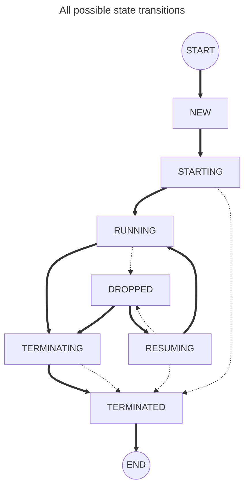

# Federate Protocol Client
Client library for HLA 4 Federate Protocol

## TODO before OSS
- [x] Exclude `c/`, `cpp/` dirs
- [x] Exclude `.teamcity/` dir
- [ ] Figure out how to get a clean history in the external repo, 
      while still maintaining the history in the internal repo.  
- [ ] Figure out how to get internal changes to the external repo, _upstream first_? 

### TODO after OSS
- [ ] Build jar using GitHub Actions
- [ ] Publish jar to Maven Central
- [ ] Add JUnit test

## Building
The Federate Protocol Client and its dependencies can be build using the ant-target `dist.all` present in `build.xml`.

### Regenerating build-targets
Regenerating the build-targets has to be done when module dependencies has changed.
For the java build, the plugin 'Ant Build Generation' in IntelliJ should be used, with the settings 'Generate single-file ant build' selected, and 'Enable UI forms compilations' disabled.

## Components

### Session component

#### Session states

The possible states a client session can be in are:
- `NEW`, this is an initial state a session is in before the start() method has been called.
- `RUNNING` and `DROPPED`, these are stable states that the session is expected to remain in for longer periods of time.
- `STARTING`, `RESUMING` and `TERMINATING`, these are transitory states that a session would be in for shorter periods of time.
- `TERMINATED`, this is a terminal state which a session will not transition away from.
A session will never do any more work as soon as this state is reached.

See the JavaDoc or the Doxygen for the `State` enum for details on each state.

The graph below describes the possible state transitions of a client session.
The dotted lines are considered "exceptional" transitions, which occur due to unexpected events like for example timeouts or network failures.

## Samples

### AsyncChat
`AsyncChat` is a basic sample that uses asynchronous versions of `updateAttributeValues()` and `sendInteraction()`.

### AsyncChatAdvanced
`AsyncChatAdvanced` uses asynchronous versions of HLA services whenever possible, and makes use of many more methods of `CompletableFuture` than `AsyncChat` does. For a good primer on `CompletableFuture`, see this article: https://liakh-aliaksandr.medium.com/asynchronous-programming-in-java-with-completablefuture-47ab86458aab
