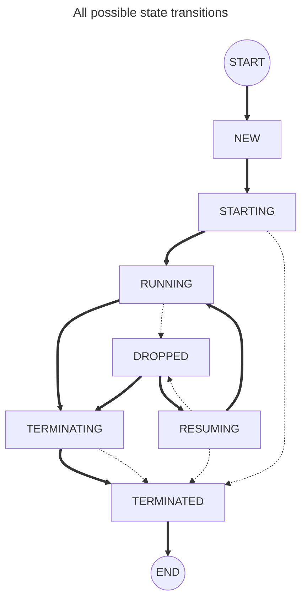

# Components

## Session component

### Session states

The possible states a client session can be in are:
- `NEW`, this is an initial state a session is in before the start() method has been called.
- `RUNNING` and `DROPPED`, these are stable states that the session is expected to remain in for longer periods of time.
- `STARTING`, `RESUMING` and `TERMINATING`, these are transitory states that a session would be in for shorter periods of time.
- `TERMINATED`, this is a terminal state which a session will not transition away from.
  A session will never do any more work as soon as this state is reached.

See the JavaDoc or the Doxygen for the `State` enum for details on each state.

The graph below describes the possible state transitions of a client session.
The dotted lines are considered "exceptional" transitions, which occur due to unexpected events like for example timeouts or network failures.

